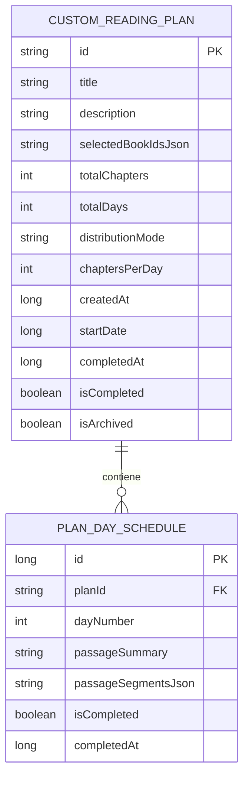

# 📜 Plan Estratégico de Implementación: Creación Manual y Gestión de Planes Bíblicos Personalizados

**Rol:** Senior Android Developer & UI/UX Specialist (Kotlin & Jetpack Compose)  
**Proyecto:** BibleVerse Android  
**Documento:** `PLAN_CREACION_PLANES_BIBLICOS_CUSTOM.md`  
**Fecha:** Octubre 2026  

---

## 1. 🎯 Visión y Objetivos del Proyecto

El sistema actual de planes bíblicos cuenta con 3 planes estáticos codificados en enumeradores (`TRADITIONAL`, `CHRONOLOGICAL`, `BIBLE_STORIES`). Aunque son valiosos, limitan al usuario a agendas fijas de 365 o 749 días.

El objetivo de este plan es dotar a **BibleVerse** de un **motor dinámico de planes personalizados** que permita:
1. **Crear cualquier plan a la medida**: Seleccionar libros específicos (ej. los 4 Evangelios, Epístolas Paulinas, Salmos y Proverbios, o libros individuales) y definir el ritmo de lectura deseado.
2. **Flexibilidad total de ritmo**:
   - **Opción A (Por días límite)**: "Quiero leer los 4 Evangelios en 30 días" $\rightarrow$ El sistema calcula y distribuye los 89 capítulos de forma equitativa.
   - **Opción B (Por capítulos diarios)**: "Quiero leer 2 capítulos al día" $\rightarrow$ El sistema calcula automáticamente la fecha estimada de finalización y el total de días necesarios.
3. **Soporte Multi-Plan sin saturar la UI**: Permitir tener varios planes activos simultáneamente (ej. un plan del Nuevo Testamento en la mañana y Salmos en la noche) con una interfaz limpia, organizada en tarjetas de progreso diario.
4. **Ciclo de vida y Registro Histórico**: Cuando un plan llega al 100%, se retira de la lista activa con una celebración visual y pasa a una sección de **Historial / Planes Completados**, donde queda registrado el logro con fecha de inicio, fecha de fin y medalla conmemorativa.

---

## 2. 🏗️ Arquitectura de Datos: De Planes Estáticos a Modelo Híbrido Dinámico

### 2.1. Problema del Modelo Actual
- Los planes están definidos en el enum `ReadingPlanType` y los progresos se guardan en un string set dentro de `SharedPreferences`.
- No es posible instanciar planes dinámicos con distintos libros ni guardar fechas de inicio/fin individuales.

### 2.2. Nueva Solución de Persistencia (Room Database)
Se creará un módulo de base de datos Room para planes personalizados, conviviendo limpiamente con el catálogo predeterminado:



#### Entidades en Kotlin:
1. **`CustomReadingPlanEntity`**:
   - `id`: UUID (String)
   - `title`: String (ej. "Los 4 Evangelios en 30 días")
   - `categoryTag`: String (ej. "Evangelios", "Nuevo Testamento", "Devocional")
   - `selectedBookIds`: `List<Int>` (guardado como TypeConverter JSON)
   - `totalChapters`: Int
   - `totalDays`: Int
   - `distributionMode`: Enum (`BY_TARGET_DAYS` vs `BY_CHAPTERS_PER_DAY`)
   - `chaptersPerDay`: Int?
   - `createdAt`: Long
   - `completedAt`: Long?
   - `isCompleted`: Boolean
   - `isArchived`: Boolean

2. **`CustomPlanDayScheduleEntity`**:
   - `planId`: String (Foreign Key en cascada)
   - `dayNumber`: Int (1..totalDays)
   - `passageSummary`: String (ej. "Mateo 1 - Mateo 3")
   - `primaryBookId`: Int
   - `primaryChapter`: Int
   - `passagesJson`: String (Lista de segmentos `PlanPassageSegment`)
   - `isCompleted`: Boolean
   - `completedAt`: Long?

---

## 3. 🧠 Algoritmo de Distribución Inteligente de Capítulos

El motor debe distribuir los capítulos de los libros seleccionados de forma fluida, continua y matemáticamente equilibrada:

### 3.1. Recopilación de Capítulos
1. Se toma la lista ordenada de `selectedBookIds` elegidos por el usuario.
2. A partir de `BibleCatalog`, se expande cada libro a su secuencia canónica de capítulos:
   $$\text{Capítulos Totales} = \sum_{b \in \text{libros}} \text{chaptersCount}(b)$$
   *Ejemplo: Mateo (28) + Marcos (16) + Lucas (24) + Juan (21) = 89 capítulos.*

### 3.2. Estrategia A: Distribución por Días Límite (`BY_TARGET_DAYS`)
Si el usuario especifica $D$ días (ej. 89 capítulos en 30 días):
- Tasa base: $\lfloor 89 / 30 \rfloor = 2$ capítulos por día.
- Días con capítulo extra (residuo): $89 \pmod{30} = 29$ días de 3 capítulos y 1 día de 2 capítulos.
- Se distribuyen los capítulos extras al inicio o equitativamente para que el esfuerzo diario sea casi idéntico.

### 3.3. Estrategia B: Distribución por Capítulos Diarios (`BY_CHAPTERS_PER_DAY`)
Si el usuario especifica $C$ capítulos diarios (ej. 2 capítulos al día):
- Días totales calculados: $\lceil 89 / 2 \rceil = 45$ días.
- Días 1 al 44: 2 capítulos.
- Día 45: 1 capítulo restante.
- Fecha estimada de fin: $\text{Hoy} + 45\text{ días}$.

---

## 4. 🎨 Rediseño UI/UX del Módulo de Planes (Soporte Multi-Plan)

Para evitar que tener 2 o 3 planes simultáneos desordene la pantalla, se reestructura la vista principal de Planes (`ReadingPlansBottomSheet.kt` / `ReadingPlansScreen.kt`) con una arquitectura de 3 pestañas principales:

```
┌─────────────────────────────────────────────────────────────┐
│  ←  Planes de Lectura Bíblica                     [ + Crear ]│
├─────────────────────────────────────────────────────────────┤
│   [ Mis Planes (2) ]   [ Catálogo ]   [ Historial (3) ]     │
├─────────────────────────────────────────────────────────────┤
│                                                             │
│  ┌─ MI PLAN ACTIVO 1 ────────────────────────────────────┐  │
│  │ 📖 Los 4 Evangelios en 30 Días           [ 40% ]      │
│  │ ████████████░░░░░░░░░░░░░░░░░░░░░░░░░░                │
│  │ Hoy: Día 12 • Lucas 1 - Lucas 3                       │
│  │ [ ▶ Continuar Lectura ]          [ Marcar Completado ]│
│  └───────────────────────────────────────────────────────┘  │
│                                                             │
│  ┌─ MI PLAN ACTIVO 2 ────────────────────────────────────┐  │
│  │ 📜 Sabiduría: Salmos y Proverbios         [ 15% ]     │
│  │ ████░░░░░░░░░░░░░░░░░░░░░░░░░░░░░░░░░░                │
│  │ Hoy: Día 5 • Salmos 23 - Salmos 27                    │
│  │ [ ▶ Continuar Lectura ]          [ Marcar Completado ]│
│  └───────────────────────────────────────────────────────┘  │
│                                                             │
└─────────────────────────────────────────────────────────────┘
```

### 4.1. Pestaña 1: "Mis Planes" (Activos)
- Muestra una lista vertical de tarjetas de planes actualmente en curso.
- Cada tarjeta contiene:
  - Título personalizado y porcentaje visual.
  - Indicador de "Lectura de Hoy" con botón de **1 solo toque** para abrir directamente los capítulos en el Lector.
  - Checkbox rápido para marcar el día como completado.
  - Menú contextual (3 puntos): Ver desglose de todos los días, Pausar o Eliminar plan.

### 4.2. Pestaña 2: "Explorar / Catálogo"
- Ofrece los planes canónicos globales (Plan Clásico en 1 año, Plan Cronológico, 749 Historias Bíblicas).
- Botón banner destacado: **"Crear mi propio plan a medida"** que lanza el asistente de creación.

### 4.3. Pestaña 3: "Historial / Completados"
- Lista de planes que alcanzaron el 100% de días completados.
- Tarjeta con medalla dorada (🏆), fechas de inicio y culminación, tiempo total invertido.
- Opciones: "Volver a leer este plan" (lo reinicia como nuevo) o "Eliminar registro".
- También accesible desde la pantalla de **Ajustes** bajo la sección *"Historial de Planes Bíblicos"*.

---

## 5. 🛠️ Flujo de Creación Paso a Paso (Plan Wizard)

Al pulsar **"Crear Plan"**, se despliega una pantalla/modal guiado en 3 pasos ergonómicos:


### Paso 1: Identidad y Filtros Rápidos (Presets)
- Campo de texto: *"Nombre del plan"* (con autocompletado inteligente).
- Chips de selección rápida con 1 toque:
  - `⚡ Los 4 Evangelios` (Mateo a Juan • 89 caps)
  - `📜 El Pentateuco` (Génesis a Deuteronomio • 187 caps)
  - `✉️ Epístolas Paulinas` (Romanos a Filemón • 87 caps)
  - `🕊️ Sabiduría y Poesía` (Job a Cantares • 243 caps)
  - `📖 Nuevo Testamento` (260 caps)
  - `🏛️ Antiguo Testamento` (929 caps)
  - `✨ Toda la Biblia` (1,189 caps)

### Paso 2: Selección Manual Detallada
- Si el usuario no quiere un preset, puede marcar casillas individuales de los 66 libros organizados en dos pestañas (`Antiguo Testamento` / `Nuevo Testamento`).
- Contador flotante en tiempo real: *"4 libros seleccionados • 89 capítulos totales"*.

### Paso 3: Ritmo y Distribución de Lectura
- Selector tipo pestaña:
  - **[ Por Días Límite ]**: Selector numérico (ej. 30 días, 60 días, 90 días, 365 días). Muestra: *"Aprox. 3 capítulos por día"*.
  - **[ Por Capítulos Diarios ]**: Selector numérico (ej. 1, 2, 3, 5 capítulos diarios). Muestra: *"Terminarás en 45 días (18 de Noviembre)"*.
- Resumen interactivo: Previsualización de los primeros 3 días ("Día 1: Mateo 1-3", "Día 2: Mateo 4-6").
- Botón primario: **"Crear y Comenzar Plan"**.

---

## 6. 🏆 Ciclo de Vida y Transición al Historial

1. **Avance Diario**:
   - Cada vez que el usuario marca un día completado, se actualiza el porcentaje y el cursor avanza al siguiente día pendiente.
2. **Momento de Culminación (100%)**:
   - Al marcar el último día:
     - Se lanza un diálogo de celebración con felicitación devocional (*"¡Gloria a Dios! Has completado con éxito 'Los 4 Evangelios en 30 días'"*).
     - Se marca `isCompleted = true` y `completedAt = System.currentTimeMillis()`.
     - El plan desaparece automáticamente de la pestaña "Mis Planes" y se archiva en "Historial".

---

## 7. 📅 Hoja de Ruta de Implementación (Roadmap por Fases)

| Fase | Alcance y Tareas | Archivos Clave |
| :--- | :--- | :--- |
| **Fase 1: Capa de Datos Room** | • Definir `CustomReadingPlanEntity` y `CustomPlanDayScheduleEntity`.<br>• Crear `CustomReadingPlanDao` con queries reactivas Flow.<br>• Añadir entidades a `BibleDatabase`. | `app/src/main/java/com/example/data/database/`<br>`entities/CustomReadingPlanEntity.kt` |
| **Fase 2: Motor de Distribución** | • Implementar `CustomPlanGenerator` con algoritmos `BY_TARGET_DAYS` y `BY_CHAPTERS_PER_DAY`.<br>• Pruebas unitarias de división exacta y residuos. | `app/src/main/java/com/example/domain/plan/`<br>`CustomPlanGenerator.kt` |
| **Fase 3: Asistente de Creación (Wizard)** | • Crear `CreateCustomPlanDialog.kt` con presets rápidos, selector de libros y cálculo de días/caps.<br>• Validación de al menos 1 libro y ritmo válido. | `app/src/main/java/com/example/ui/screens/components/`<br>`CreateCustomPlanDialog.kt` |
| **Fase 4: Rediseño Multi-Plan** | • Reestructurar `ReadingPlansBottomSheet.kt` en 3 pestañas: *Mis Planes*, *Catálogo*, *Historial*.<br>• Diseñar tarjetas de planes activos con barra de progreso y botón de 1 toque. | `ReadingPlansBottomSheet.kt`<br>`ActivePlanCard.kt`<br>`CompletedPlanCard.kt` |
| **Fase 5: Historial y Ajustes** | • Pantalla/sección de consulta de planes terminados con fecha y repetición.<br>• Acceso directo desde `SettingsTab.kt`. | `SettingsTab.kt`<br>`PlanHistorySection.kt` |

---

## 8. ✅ Criterios de Aceptación y Verificación

1. El usuario puede crear un plan de los 4 Evangelios seleccionando 30 días, y el sistema genera 30 días balanceados de ~3 capítulos cada uno.
2. El usuario puede crear otro plan eligiendo 2 capítulos diarios sin especificar días, y el sistema calcula la duración exacta.
3. Se pueden tener 2 o más planes activos a la vez en la pestaña "Mis Planes", leyendo cualquiera de ellos independientemente.
4. Al completar el 100% de los días de un plan, este se traslada automáticamente a la pestaña "Historial" con su fecha de culminación registrada.
5. El diseño mantiene la línea devocional, colores acordes a Material 3 y compatibilidad offline sin requerir conexión a internet.
